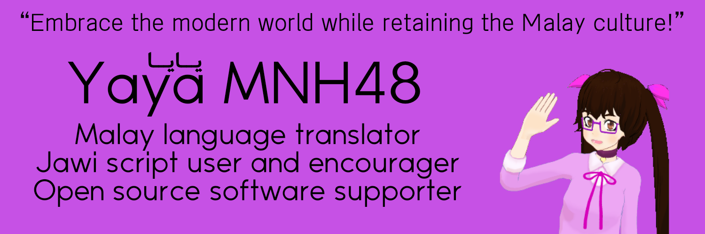

### Hello, I'm Yaya MNH48 🙋🏻

I'm Yaya MNH48, a Malay language translator who code in my free time. My motto is “embrace the modern world while retaining the Malay culture”.

#### Major Malay translation project
 ∷  ∷ 

More at my [translation tracker](https://tl.mnh48.moe) website.

#### Technical projects I'm working on
- Jawi Font ([jawi-mnh48/jawifont](https://github.com/jawi-mnh48/jawifont)) : Edited version of Arabic font files to add support for Jawi alphabets. Jawi is the older and still living script for Malay language.
- MNH48 Beringin ([jawi-mnh48/mnh48-beringin](https://github.com/jawi-mnh48/mnh48-beringin)) : Attempt to create a font to display Beringin alphabets. Beringin is a constructed script for Malay and Indonesian languages.

#### Non-technical projects I'm working on
- Rearranging my Discord server structure
- Writing draft of contents for my websites
- Finalizing the details of my identity for my upcoming virtual YouTuber (vtuber) videos

#### Current source of income
I'm currently __unemployed__, if you're seeking for employee with computing science background in Malaysia **and** your company has policies against discrimination, especially policy that could protect transgenders, then do contact me. All the companies that I had looked through to apply for jobs so far doesn't have such policy, and so I don't feel safe to apply for jobs in their companies even if there are many positions that I'm interested in.

I have Bachelor of Computer Science (Hons.) from Universiti Teknologi MARA, Shah Alam, Selangor; and Diploma in Computer Science from Universiti Teknologi MARA, Arau, Perlis. I prefer vanilla web development or software programming, but I will accept any other positions if it's good enough and worth the wages offered.

For short-term support, you can tip in some money through:

 ∷  ∷ [![Streamlabs](https://img.shields.io/badge/Streamlabs-Donation-brightgreen?style=flat-square&logo=data:image/svg+xml;base64,PHN2ZyB3aWR0aD0iMTYiIGhlaWdodD0iMTYiIHZpZXdCb3g9IjAgMCAxNiAxNiIgZmlsbD0ibm9uZSIgeG1sbnM9Imh0dHA6Ly93d3cudzMub3JnLzIwMDAvc3ZnIj4KPHBhdGggZD0iTTAgMi4yNEMwIDEuMDAyODggMS4wMDI4OCAwIDIuMjQgMEgxMy43NkMxNC45OTcxIDAgMTYgMS4wMDI4OCAxNiAyLjI0VjEzLjc2QzE2IDE0Ljk5NzEgMTQuOTk3MSAxNiAxMy43NiAxNkgyLjI0QzEuMDAyODggMTYgMCAxNC45OTcxIDAgMTMuNzZWMi4yNFoiIGZpbGw9IiM4MEY1RDIiLz4KPHBhdGggZmlsbC1ydWxlPSJldmVub2RkIiBjbGlwLXJ1bGU9ImV2ZW5vZGQiIGQ9Ik0xNCA2LjczOTEyVjguNjY3NjlDMTQgOS4zNzc3NyAxMy40MjQ0IDkuOTUzNCAxMi43MTQzIDkuOTUzNEgxMi4wNzE0VjEwLjY4MkMxMi4wNzE0IDExLjI3MzcgMTEuNTkxNyAxMS43NTM0IDExIDExLjc1MzRINy41MjQ5QzcuNTEzNTMgMTEuNzUzNCA3LjUwMjYyIDExLjc1NzkgNy40OTQ1OSAxMS43NjZMNi4xNjc1NCAxMy4wOTNDNi4wMDU1NSAxMy4yNTUgNS43Mjg1NyAxMy4xNDAzIDUuNzI4NTcgMTIuOTExMlYxMS43OTYzQzUuNzI4NTcgMTEuNzcyNiA1LjcwOTM4IDExLjc1MzQgNS42ODU3MSAxMS43NTM0SDVDNC40MDgyNyAxMS43NTM0IDMuOTI4NTcgMTEuMjczNyAzLjkyODU3IDEwLjY4MlY5Ljk1MzRIMy4yODU3MUMyLjU3NTYzIDkuOTUzNCAyIDkuMzc3NzcgMiA4LjY2NzY5VjYuNzM5MTJDMiA2LjAyOTA0IDIuNTc1NjMgNS40NTM0IDMuMjg1NzEgNS40NTM0VjUuMTk2MjZDMy4yODU3MSA0LjE1NDgxIDQuMTI5OTggMy4zMTA1NSA1LjE3MTQzIDMuMzEwNTVIMTAuODI4NkMxMS44NyAzLjMxMDU1IDEyLjcxNDMgNC4xNTQ4MSAxMi43MTQzIDUuMTk2MjZWNS40NTM0QzEzLjQyNDQgNS40NTM0IDE0IDYuMDI5MDQgMTQgNi43MzkxMlpNNC41NzE0MyA1LjE5NjI2QzQuNTcxNDMgNC44NjQ4OSA0Ljg0MDA2IDQuNTk2MjYgNS4xNzE0MyA0LjU5NjI2SDEwLjgyODZDMTEuMTU5OSA0LjU5NjI2IDExLjQyODYgNC44NjQ4OSAxMS40Mjg2IDUuMTk2MjZWNS40NTM0SDQuNTcxNDNWNS4xOTYyNlpNOCA4LjcxMDU1TDcuNjg5MTUgOS43MTIxN0M3LjY0NDYzIDkuODU1NjMgNy41MTE5MSA5Ljk1MzQgNy4zNjE3IDkuOTUzNEg0LjU3MTQzVjEwLjY4MkM0LjU3MTQzIDEwLjkxODcgNC43NjMzIDExLjExMDUgNSAxMS4xMTA1SDYuMTU3MTRDNi4yNzU0OSAxMS4xMTA1IDYuMzcxNDMgMTEuMjA2NSA2LjM3MTQzIDExLjMyNDhWMTEuNzk2M1YxMS45OEw3LjAxNDI5IDExLjMzNzFMNy4xNzgxIDExLjE3MzNDNy4yMTgyOSAxMS4xMzMxIDcuMjcyNzkgMTEuMTEwNSA3LjMyOTYyIDExLjExMDVINy41MjQ5SDExQzExLjIzNjcgMTEuMTEwNSAxMS40Mjg2IDEwLjkxODcgMTEuNDI4NiAxMC42ODJWOS45NTM0SDguNjM4M0M4LjQ4ODA5IDkuOTUzNCA4LjM1NTM3IDkuODU1NjMgOC4zMTA4NSA5LjcxMjE3TDggOC43MTA1NVpNMi44NTcxNCA2LjczOTEyQzIuODU3MTQgNi41MDI0MiAzLjA0OTAyIDYuMzEwNTUgMy4yODU3MSA2LjMxMDU1VjUuODgxOThDMi44MTIzMyA1Ljg4MTk4IDIuNDI4NTcgNi4yNjU3MyAyLjQyODU3IDYuNzM5MTJWOC42Njc2OUMyLjQyODU3IDguNzg2MDQgMi41MjQ1MSA4Ljg4MTk4IDIuNjQyODYgOC44ODE5OEMyLjc2MTIxIDguODgxOTggMi44NTcxNCA4Ljc4NjA0IDIuODU3MTQgOC42Njc2OVY2LjczOTEyWk0xMy4xNDI5IDYuNzM5MTJDMTMuMTQyOSA2LjUwMjQyIDEyLjk1MSA2LjMxMDU1IDEyLjcxNDMgNi4zMTA1NVY1Ljg4MTk4QzEzLjE4NzcgNS44ODE5OCAxMy41NzE0IDYuMjY1NzMgMTMuNTcxNCA2LjczOTEyVjguNjY3NjlDMTMuNTcxNCA4Ljc4NjA0IDEzLjQ3NTUgOC44ODE5OCAxMy4zNTcxIDguODgxOThDMTMuMjM4OCA4Ljg4MTk4IDEzLjE0MjkgOC43ODYwNCAxMy4xNDI5IDguNjY3NjlWNi43MzkxMlpNMy45Mjg1NyA2LjA5NjI2SDEyLjA3MTRWOC42Njc2OUMxMi4wNzE0IDkuMDIyNzMgMTEuNzgzNiA5LjMxMDU1IDExLjQyODYgOS4zMTA1NUg4LjgzNDQzQzguNzk2OTUgOS4zMTA1NSA4Ljc2MzgxIDkuMjg2MTkgOC43NTI2MyA5LjI1MDQyTDguMzI3MjMgNy44OTAyQzguMjI2OTQgNy41Njk1MSA3Ljc3MzA2IDcuNTY5NTEgNy42NzI3NyA3Ljg5MDJMNy4yNDczNyA5LjI1MDQyQzcuMjM2MTkgOS4yODYxOSA3LjIwMzA1IDkuMzEwNTUgNy4xNjU1NyA5LjMxMDU1SDQuNTcxNDNDNC4yMTYzOSA5LjMxMDU1IDMuOTI4NTcgOS4wMjI3MyAzLjkyODU3IDguNjY3NjlWNi4wOTYyNlpNNS44NTcxNCA2LjUyNDgzQzUuMzgzNzYgNi41MjQ4MyA1IDYuOTA4NTggNSA3LjM4MTk4VjguMDI0ODNDNSA4LjQ5ODIzIDUuMzgzNzYgOC44ODE5OCA1Ljg1NzE0IDguODgxOThDNi4zMzA1MyA4Ljg4MTk4IDYuNzE0MjkgOC40OTgyMyA2LjcxNDI5IDguMDI0ODNWNy4zODE5OEM2LjcxNDI5IDYuOTA4NTggNi4zMzA1MyA2LjUyNDgzIDUuODU3MTQgNi41MjQ4M1pNNS43NzE0MyA2Ljg2NzY5QzUuNTM0NzMgNi44Njc2OSA1LjM0Mjg2IDcuMDU5NTYgNS4zNDI4NiA3LjI5NjI2QzUuMzQyODYgNy41MzI5NiA1LjUzNDczIDcuNzI0ODMgNS43NzE0MyA3LjcyNDgzQzYuMDA4MTMgNy43MjQ4MyA2LjIgNy41MzI5NiA2LjIgNy4yOTYyNkM2LjIgNy4wNTk1NiA2LjAwODEzIDYuODY3NjkgNS43NzE0MyA2Ljg2NzY5Wk05LjI4NTcxIDcuMzgxOThDOS4yODU3MSA2LjkwODU4IDkuNjY5NDcgNi41MjQ4MyAxMC4xNDI5IDYuNTI0ODNDMTAuNjE2MiA2LjUyNDgzIDExIDYuOTA4NTggMTEgNy4zODE5OFY4LjAyNDgzQzExIDguNDk4MjMgMTAuNjE2MiA4Ljg4MTk4IDEwLjE0MjkgOC44ODE5OEM5LjY2OTQ3IDguODgxOTggOS4yODU3MSA4LjQ5ODIzIDkuMjg1NzEgOC4wMjQ4M1Y3LjM4MTk4Wk05LjYyODU3IDcuMjk2MjZDOS42Mjg1NyA3LjA1OTU2IDkuODIwNDUgNi44Njc2OSAxMC4wNTcxIDYuODY3NjlDMTAuMjkzOCA2Ljg2NzY5IDEwLjQ4NTcgNy4wNTk1NiAxMC40ODU3IDcuMjk2MjZDMTAuNDg1NyA3LjUzMjk2IDEwLjI5MzggNy43MjQ4MyAxMC4wNTcxIDcuNzI0ODNDOS44MjA0NSA3LjcyNDgzIDkuNjI4NTcgNy41MzI5NiA5LjYyODU3IDcuMjk2MjZaIiBmaWxsPSIjMDkxNjFEIi8+Cjwvc3ZnPgo=)](https://streamlabs.com/yaya-)

#### Current spending
Most of my money goes to paying for my room rental, which is where I'm staying in, the room where there is bed I sleep on. It's the cheapest option in the city with high cost of living, cheap that there's not even dedicated toilet and so I need to use the shared common area's toilet instead.

 ∷  ∷  ∷ 

#### Contact
 ∷  ∷ 

<!--
**mnh48/mnh48** is a ✨ _special_ ✨ repository because its `README.md` (this file) appears on your GitHub profile.

Here are some ideas to get you started:

- 🔭 I’m currently working on ...
- 🌱 I’m currently learning ...
- 👯 I’m looking to collaborate on ...
- 🤔 I’m looking for help with ...
- 💬 Ask me about ...
- 📫 How to reach me: ...
- 😄 Pronouns: ...
- ⚡ Fun fact: ...
-->

